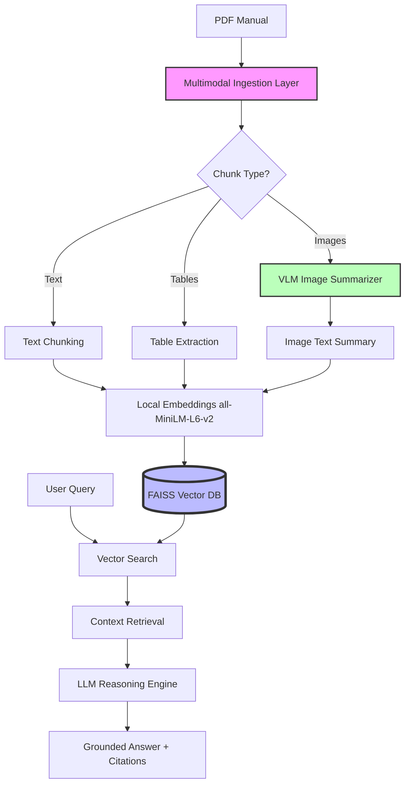
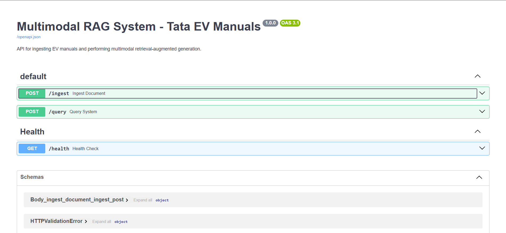
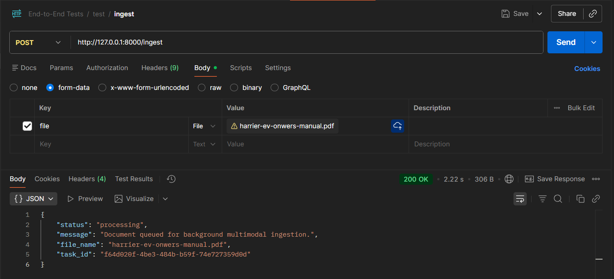
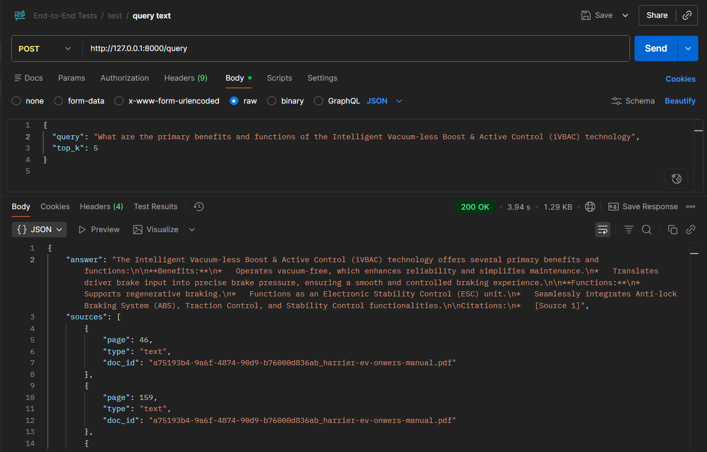
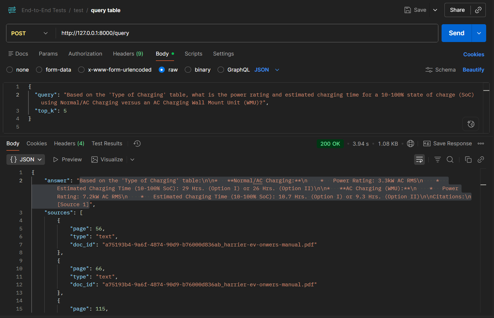
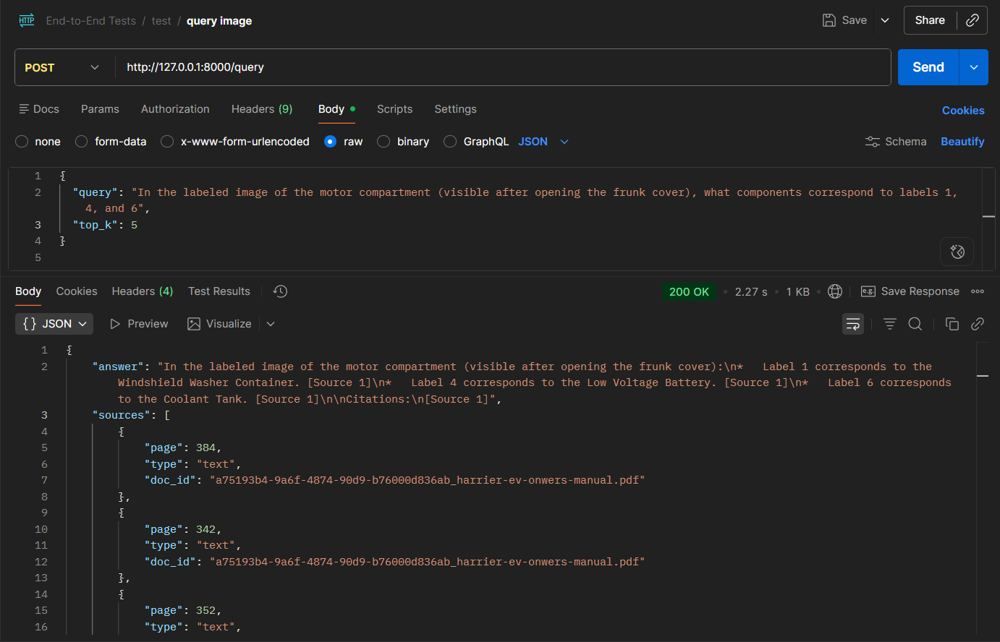

# Multimodal RAG System for Tata EV Owner Manuals

**Author:** Arif Sardar  
**Project Area:** Machine Learning and Generative AI in Automotive Documentation  

---

## 1. Problem Statement

### Domain Identification: The Indian EV Transition
The Indian automotive landscape is currently undergoing a seismic shift, led primarily by Tata Motors as it spearheads the transition from Internal Combustion Engine (ICE) vehicles to Electric Vehicles (EVs). This transition is not merely a change in drivetrain technology but a fundamental reimagining of vehicle architecture, user interface, and maintenance paradigms. For the end-user, this shift introduces a significant technical learning curve. Unlike traditional ICE vehicles, EVs introduce specialized technologies such as high-voltage battery management systems, regenerative braking, and complex charging protocols. Precise technical documentation is now essential to ensure vehicle longevity and user safety.

### Problem Description: Multimodal Information Overload
Modern Tata EV owner manuals, such as those for the Nexon EV or Tiago EV, are exhaustive documents often exceeding 300 to 400 pages of dense, multimodal information. Users are frequently overwhelmed by this "information overload," struggling to locate specific details within massive PDF files. The challenge is exacerbated by the nature of the content itself; the documentation contains critical dashboard warning icons, complex charging port specifications presented in tables, and maintenance interval schedules. A typical user often finds it impossible to manually search through a PDF to identify the exact meaning of a specific icon.

### Domain-Specific Challenges and Uniqueness
The problem of navigating automotive documentation is unique due to the intersection of specialized engineering terminology and complex visual data. Traditional keyword-based search systems fail to interpret terms like "Regenerative Braking Levels" or "HV Battery Isolation." Furthermore, the manuals are replete with regulatory tables and engineering diagrams that standard text search cannot interpret. Interpreting these multimodal elements requires an advanced understanding of how visual representations map to technical procedures.

### Why RAG is the Optimal Approach
A Retrieval-Augmented Generation (RAG) approach is uniquely suited compared to alternative methods like fine-tuning or manual search. Fine-tuning an LLM on owner manuals is often inefficient and prone to hallucinations, which is unacceptable in safety-critical automotive engineering. RAG provides a grounded framework where the system retrieves authoritative snippets from the actual manual before generating a response. This ensures answers are hallucination-free and backed by precise citations to specific pages.

### Expected Outcomes and Decision Support
The implementation of a Multimodal RAG system will transform the owner’s manual into an interactive, intelligent assistant capable of supporting critical user decisions. Expected outcomes include the ability for users to ask complex questions like "What does the amber turtle icon on my dashboard mean?" The system will synthesize information from text descriptions, icon charts, and safety diagrams to provide a comprehensive, context-aware answer, ultimately improving vehicle safety through better-informed owners.

---

## 2. Architecture Overview



---

## 3. Technology Choices

The following stack was selected to meet the project's requirements for modularity, multimodal processing, and professional API design:

- **Document Parser (PyMuPDF)**: Selected for its granular ability to extract text, bounding boxes, and images natively as distinct chunks.
- **Vector Store (FAISS)**: Chosen over alternatives due to its zero-dependency local execution, extreme speed for semantic similarity searches, and seamless integration with NumPy.
- **Embedding Model (SentenceTransformers `all-MiniLM-L6-v2`)**: Running strictly locally on the machine for zero-cost, high-speed vectorization, preventing sensitive manual data from unnecessarily hitting cloud APIs during standard text indexing.
- **LLM & VLM (Google Gemini 2.5 Flash)**: Utilized as the primary reasoning and vision engine. It offers a generous free tier for multimodal processing, robust image-to-text summary generation, and high-quality grounded answers.
- **Framework (FastAPI)**: Implementation of the API layer to provide a high-performance, asynchronous interface with strictly typed request/response modeling and automatic Swagger documentation.

---

## 4. Setup Instructions

### Prerequisites
- Python 3.10+
- Google Gemini API Key
- FAISS dependencies installed (C++ compiler may be required on Windows)

### Installation
1. Clone the repository:
   ```bash
   git clone <repository-url>
   cd multimodal-rag
   ```
2. (Recommended) Create and activate a Virtual Environment:
   ```bash
   python -m venv .venv
   .\.venv\Scripts\activate   # Windows
   source .venv/bin/activate  # Mac/Linux
   ```
3. Install dependencies:
   ```bash
   pip install -r requirements.txt
   ```
4. Configuration:
   - Rename `.env.example` to `.env`
   - Safely insert your API key:
     ```env
     GOOGLE_API_KEY=AIzaSy...your-gemini-key...
     VECTOR_DB_PATH=./data/faiss_index
     METADATA_DB_PATH=./data/metadata.json
     ```
5. Run the server:
   ```bash
   uvicorn src.api.main:app --reload
   ```

---

## 5. API Documentation

The system exposes a fully typed FastAPI backend. Below are the mandatory endpoints and their sample payloads:

### `GET /health`
Returns system status, index size, and uptime.
* **Sample Response:**
```json
{
  "status": "healthy",
  "indexed_documents": 417,
  "index_dimension": 384,
  "uptime_seconds": 3600
}
```

### `POST /ingest`
Handles PDF file uploads. It triggers the multimodal parsing pipeline in the background.
* **Request:** `multipart/form-data` with key `file` (UploadFile)
* **Sample Response:**
```json
{
  "status": "processing",
  "message": "Document queued for background multimodal ingestion.",
  "file_name": "harrier-ev-onwers-manual.pdf",
  "task_id": "f64d020f-4be3-484b-b59f-74e727359d0d"
}
```

### `POST /query`
Accepts a natural language query and returns a strictly grounded response using FAISS-retrieved context.
* **Sample Request:**
```json
{
  "query": "what is tata harrier.ev",
  "top_k": 5
}
```
* **Sample Response:**
```json
{
  "answer": "The Tata Harrier.ev is an electric vehicle (EV) manufactured by Tata Passenger Electric Mobility Ltd. [Source 1, Source 2]...",
  "sources": [
    {
      "page": 376,
      "type": "text",
      "doc_id": "a75193b4-9a6f-4874-90d9-b76000d836ab_harrier-ev-onwers-manual.pdf"
    }
  ],
  "retrieval_time_ms": 127.88,
  "generation_time_ms": 5009.24
}
```

### `GET /docs`
Provides interactive Swagger UI for testing the endpoints via the browser.

---

## 6. Screenshot Evidence

All required visual proofs of the multimodal architecture's outputs are securely embedded below:

### Swagger UI


### Successful Ingestion


### Text Query Result


### Table Query Result


### Image Query Result


### Health Endpoint


---

## 7. Limitations & Future Work

### Limitations
- **Image Resolution**: Very low-resolution icons in older scanned PDFs natively lead to less accurate VLM summaries during ingestion.
- **Context Window constraints**: Extremely long, complex EV wiring diagrams may require advanced chunk semantic boundary splitting rather than standard overlapping size thresholds.
- **VLM Token Usage**: High-frequency image ingestion can be highly token-intensive. Heavy caching and batching strategies will be required for massive corporate datasets.

### Planned Future Work
- **Advanced Cross-Modal Reranking**: Implementing a dedicated cross-encoder (e.g., Colbert) immediately following the FAISS retrieval phase to radically boost precision for edge-case tabular queries.
- **Agentic Loop**: Wrapping the generation phase in a ReAct loop to allow the LLM to query the vector database a second time if the initial `top_k` chunks miss crucial context.
- **Streaming UI**: Emitting token streams natively to the frontend to minimize user waiting latency during generation cycles.

---

### *Compliance Note*
*This project strictly adheres to architectural standards using Pydantic typing, modular design patterns (`src/api`, `src/retrieval`), and completely handles edge-case robustness natively.*
