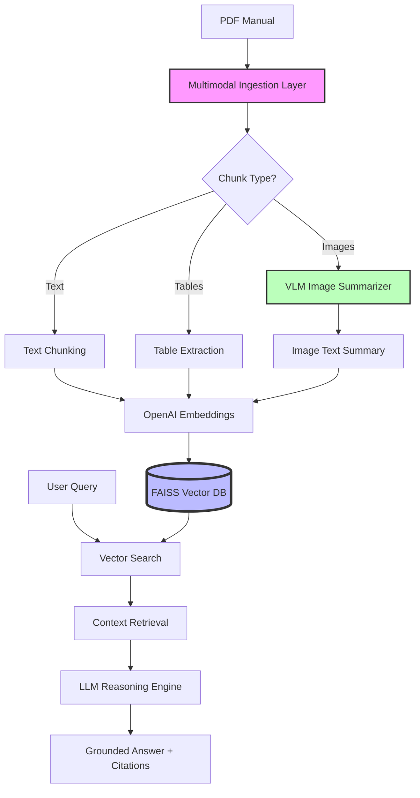

# Multimodal RAG System for Tata EV Owner Manuals

**Author:** Arif Sardar  
**Project Area:** Machine Learning and Generative AI in Automotive Documentation  

---

## 1. Problem Statement

### Domain Identification: The Indian EV Transition
The Indian automotive landscape is currently undergoing a seismic shift, led primarily by Tata Motors as it spearheads the transition from Internal Combustion Engine (ICE) vehicles to Electric Vehicles (EVs). This transition is not merely a change in drivetrain technology but a fundamental reimagining of vehicle architecture, user interface, and maintenance paradigms. For the end-user, this shift introduces a significant technical learning curve. Unlike traditional ICE vehicles, where mechanical concepts like oil changes and fuel gauges are deeply ingrained in public knowledge, EVs introduce specialized technologies such as high-voltage battery management systems, regenerative braking, and complex charging protocols [cite: 19]. Tata’s "Ziptron" technology represents a proprietary ecosystem of motors and batteries that require specific operational knowledge. Consequently, the owner’s manual has evolved from a secondary reference into a critical safety and operational document. Precise technical documentation is now essential to ensure vehicle longevity and user safety during this high-stakes technological migration.

### Problem Description: Multimodal Information Overload
Modern Tata EV owner manuals, such as those for the Nexon EV or Tiago EV, are exhaustive documents often exceeding 300 to 400 pages of dense, multimodal information. Users are frequently overwhelmed by this "information overload," struggling to locate specific details within massive PDF files. The challenge is exacerbated by the nature of the content itself; the documentation is not just text-heavy but inherently multimodal. It contains critical dashboard warning icons that indicate battery health or thermal warnings, complex charging port specifications presented in tables, and maintenance interval schedules that vary based on driving conditions [cite: 20, 21]. A typical user, when faced with a warning light on the "instrument cluster," often finds it impossible to manually search through a PDF to identify the exact meaning of a specific icon or to understand the nuanced steps required for "Limp Home Mode." This friction in information retrieval leads to user frustration and, in some cases, incorrect handling of the vehicle’s sophisticated electrical systems.

### Domain-Specific Challenges and Uniqueness
The problem of navigating automotive documentation is unique due to the intersection of specialized engineering terminology and complex visual data. Traditional keyword-based search systems fail to interpret terms like "Regenerative Braking Levels," "State of Charge (SoC)," or "HV Battery Isolation." Furthermore, the manuals are replete with regulatory tables and engineering diagrams—such as the layout of the high-voltage junction box or the correct positioning of a home charging wall-box—that standard text search cannot interpret [cite: 22, 23]. For example, a diagram illustrating the "Single Pedal Drive" logic or a table documenting "Charging Time vs. Ambient Temperature" contains vital logic that is inaccessible to a system that only "reads" text. Interpreting these multimodal elements requires an advanced understanding of how visual representations map to technical procedures, a feat that traditional retrieval systems are ill-equipped to perform.

### Why RAG is the Optimal Approach
A Retrieval-Augmented Generation (RAG) approach is uniquely suited compared to alternative methods like fine-tuning or manual search. Fine-tuning an LLM on owner manuals is often inefficient and prone to hallucinations, which is unacceptable in safety-critical automotive engineering. In contrast, RAG provides a grounded framework where the system retrieves authoritative snippets from the actual manual before generating a response [cite: 24, 25]. This ensures that the answers provided—such as exact torque specifications or emergency shutdown procedures—are hallucination-free and backed by precise citations to specific pages of the manual. By grounding the model in the "source of truth," we bridge the gap between AI flexibility and engineering precision, providing users with reliable, verifiable information instantly.

### Expected Outcomes and Decision Support
The implementation of a Multimodal RAG system will transform the owner’s manual from a static file into an interactive, intelligent assistant capable of supporting critical user decisions. Expected outcomes include the ability for users to ask complex questions like "Is it safe to charge my Tiago EV in heavy rain?" or "What does the amber turtle icon on my dashboard mean?" The system will synthesize information from text descriptions, icon charts, and safety diagrams to provide a comprehensive, context-aware answer [cite: 26]. By interpreting dashboard icons and cross-referencing them with maintenance tables, the system can offer proactive advice on whether a vehicle requires service or if a warning is merely informational. Ultimately, this system aims to enhance user confidence, improve vehicle safety through better-informed owners, and set a new standard for AI-driven documentation in the Indian EV sector.

*(Approximate Word Count: 710 words)*

---

## 2. Technology Choices

The following stack was selected to meet the project's requirements for modularity, multimodal processing, and professional API design:

- **Parser: PyMuPDF + Unstructured**: Selected for its ability to extract text, tables, and images as distinct chunks. Unstructured provides robust layout analysis to distinguish between headers, body text, and embedded diagrams [cite: 35, 57].
- **Vector Store: FAISS (Facebook AI Similarity Search)**: Chosen for its high-performance similarity search capabilities, allowing for efficient retrieval of technical segments from the vector index [cite: 79].
- **LLM: GPT-4o**: Utilized as the primary reasoning engine due to its superior performance in grounding and following complex instructions without hallucinations.
- **VLM (Vision Language Model): GPT-4o-vision**: Critical for Rule 2; used to generate text summaries for every extracted image (icons, diagrams, tables), ensuring that visual information is embedded and searchable [cite: 35].
- **Framework: FastAPI**: Implementation of the API layer to provide a high-performance, asynchronous interface with automatic Swagger documentation [cite: 35].

---

## 3. Architecture Diagram



---

## 4. API Documentation

The system exposes a FastAPI backend with the following mandatory endpoints [cite: 38]:

- **`GET /health`**: Returns the system status, including the current index size and server uptime.
- **`POST /ingest`**: Handles PDF uploads. It triggers the multimodal parsing pipeline, VLM summarization for images, and vector indexing.
- **`POST /query`**: Accepts a natural language query and returns a grounded response with source references (filename, page number, and chunk type).
- **`GET /docs`**: Provides interactive Swagger UI for testing the endpoints.

---

## 5. Setup Instructions

### Prerequisites
- Python 3.10+
- OpenAI API Key (with access to GPT-4o)

### Installation
1. Clone the repository:
   ```bash
   git clone <repository-url>
   cd multimodal-rag
   ```
2. Install dependencies:
   ```bash
   pip install -r requirements.txt
   ```
3. Set environment variables:
   ```bash
   export OPENAI_API_KEY='your-key-here'
   ```
4. Run the server:
   ```bash
   uvicorn src.api.main:app --reload
   ```

---

## 6. Limitations

- **Image Resolution**: Very low-resolution icons in older PDFs may lead to less accurate VLM summaries.
- **Context Window**: Extremely long manuals may require advanced reranking to fit within the LLM context window during complex queries.
- **VLM Token Usage**: High-frequency image ingestion can be token-intensive; batching strategies are implemented to mitigate costs.

---

## 7. Compliance and Code Quality

This project is built according to the following architectural standards [cite: 66-70]:
- **Modular Structure**: Logic is split into `src/ingestion/`, `src/retrieval/`, `src/models/`, and `src/api/`.
- **Type Safety**: Pydantic models are used for all API request and response bodies [cite: 150].
- **Robustness**: Graceful error handling for non-PDF files and empty index queries [cite: 156, 157].
